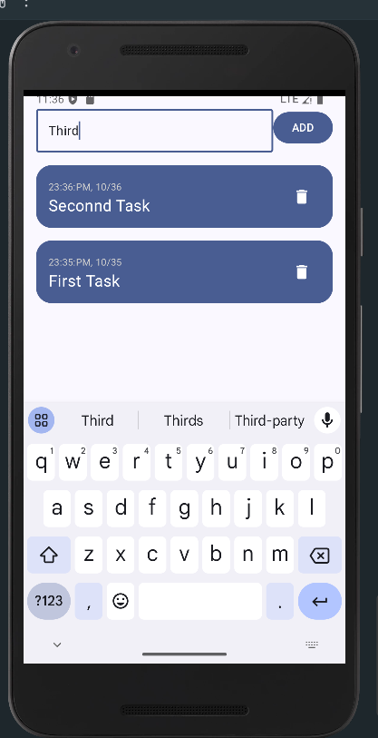

# 📱 Todo List App

A simple yet elegant **To-Do List** Android application developed using **Jetpack Compose** and **Room Database**. This project demonstrates modern Android development practices, focusing on a clean architecture and efficient state management.

---
## 🎨 UI Preview

Take a look at the clean and intuitive user interface of the Todo List App! Designed with modern Android tools like Jetpack Compose, this app offers a smooth and responsive experience for managing your tasks. From adding new tasks to checking them off, the UI is designed to keep you productive and organized.

Here’s a glimpse of what the app looks like in action:

Feel free to explore the code and see how it all comes together to create a beautiful, functional task management app!

> *Add tasks with a single tap and manage your day efficiently.*

---
## 🛠 Tech Stack

- **Kotlin** – Primary language  
- **Jetpack Compose** – Modern declarative UI toolkit  
- **Room Database (DAO)** – Local data persistence  
- **ViewModel** – Lifecycle-aware task state management

---

## ✨ Features

- Add new tasks with timestamps  
- Delete individual tasks  
- Tasks persist after app restarts (using Room)  
- Clean, Compose-based UI with responsive design

---

## 📚 What I Learned

**✨ “Every project is a learning journey – here’s what I discovered!”**

- 🎨 Mastered Jetpack Compose for modern declarative UI

- 🗃️ Integrated Room Database for persistent storage

- 🧠 Used ViewModel for effective state management

- 🧩 Structured the app using clean architecture principles

- 🧪 Debugged UI behaviors and polished UX interactions

- 📁 Organized code into reusable, scalable components

- 🚀 Got comfortable with Kotlin DSL and build.gradle.kts

---

## 🔮 Future Enhancements

🚧 This app is just the beginning. Here’s what’s next!

- ✏️ **Task Editing** – Allow users to modify existing tasks

- ⏰ **Reminders & Notifications** – Alert users for due tasks

- 🌙 **Dark Mode** – Toggle theme based on system settings

- 📂 **Task Categories** – Organize tasks by labels or folders

- ☁️ **Cloud Sync** – Store and sync data via Firebase or Drive

- 🔍 **Search & Filter** – Quickly find specific tasks

